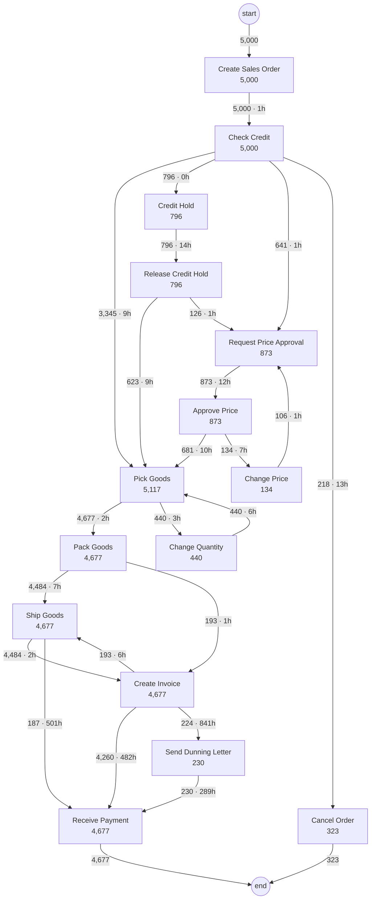

# Discovered process map (edges used by ≥ 2 % of cases; label = cases · median wait)

```mermaid
flowchart TD
    START((start))
    END((end))
    ApprovePrice["Approve Price<br/>873"]
    CancelOrder["Cancel Order<br/>323"]
    ChangePrice["Change Price<br/>134"]
    ChangeQuantity["Change Quantity<br/>440"]
    CheckCredit["Check Credit<br/>5,000"]
    CreateInvoice["Create Invoice<br/>4,677"]
    CreateSalesOrder["Create Sales Order<br/>5,000"]
    CreditHold["Credit Hold<br/>796"]
    PackGoods["Pack Goods<br/>4,677"]
    PickGoods["Pick Goods<br/>5,117"]
    ReceivePayment["Receive Payment<br/>4,677"]
    ReleaseCreditHold["Release Credit Hold<br/>796"]
    RequestPriceApproval["Request Price Approval<br/>873"]
    SendDunningLetter["Send Dunning Letter<br/>230"]
    ShipGoods["Ship Goods<br/>4,677"]
    START -->|5,000| CreateSalesOrder
    CreateSalesOrder -->|5,000 · 1h| CheckCredit
    PickGoods -->|4,677 · 2h| PackGoods
    PackGoods -->|4,484 · 7h| ShipGoods
    ShipGoods -->|4,484 · 2h| CreateInvoice
    CreateInvoice -->|4,260 · 482h| ReceivePayment
    CheckCredit -->|3,345 · 9h| PickGoods
    RequestPriceApproval -->|873 · 12h| ApprovePrice
    CreditHold -->|796 · 14h| ReleaseCreditHold
    CheckCredit -->|796 · 0h| CreditHold
    ApprovePrice -->|681 · 10h| PickGoods
    CheckCredit -->|641 · 1h| RequestPriceApproval
    ReleaseCreditHold -->|623 · 9h| PickGoods
    ChangeQuantity -->|440 · 6h| PickGoods
    PickGoods -->|440 · 3h| ChangeQuantity
    SendDunningLetter -->|230 · 289h| ReceivePayment
    CreateInvoice -->|224 · 841h| SendDunningLetter
    CheckCredit -->|218 · 13h| CancelOrder
    PackGoods -->|193 · 1h| CreateInvoice
    CreateInvoice -->|193 · 6h| ShipGoods
    ShipGoods -->|187 · 501h| ReceivePayment
    ApprovePrice -->|134 · 7h| ChangePrice
    ReleaseCreditHold -->|126 · 1h| RequestPriceApproval
    ChangePrice -->|106 · 1h| RequestPriceApproval
    ReceivePayment -->|4,677| END
    CancelOrder -->|323| END
```
